# Astro App 🔮

A comprehensive astrology mobile application built with React Native and Expo Router, offering personalized astrological consultations, daily horoscopes, and spiritual guidance.

<div style="display: flex; flex-direction: 'row'; justify-content: 'center'">

</div>

## 📱 Features

### 🔐 Authentication

- Phone number-based login
- OTP verification
- Skip login for guest access
- Secure session management

### 🏠 Home Dashboard

- Personalized horoscope recommendations
- Featured astrologers
- Quick access to all services
- Search functionality for astrologers
- Daily spiritual content

### 💬 Consultation Services

- **Chat Consultation**: Real-time messaging with astrologers
- **Voice Calls**: Direct phone consultations
- **Live Sessions**: Group astrology sessions
- Category-based astrologer filtering (Love & Relationship, Career & Job, etc.)

### 📚 Content & Learning

- **Daily Blogs**: Spiritual and astrological insights
- **News**: Latest astrology and spiritual news
- **Panchang**: Daily astrological calendar
- **Behind the Scenes**: Educational content

### 🛒 Shopping

- Spiritual products and accessories
- Gemstones and crystals
- Religious items
- Category-based shopping experience

### 💰 Wallet & Payments

- In-app wallet system
- Secure payment integration with Stripe
- Transaction history
- Balance management

### 📱 User Experience

- **Drawer Navigation**: Easy access to all features
- **Tab Navigation**: Quick switching between main sections
- **History**: Track all past consultations
- **Notifications**: Stay updated with important alerts
- **Profile Management**: Manage personal information

## 🛠️ Technology Stack

### Frontend

- **React Native** (0.79.2) - Cross-platform mobile development
- **Expo** (~53.0.9) - Development platform and tools
- **TypeScript** (~5.8.3) - Type-safe JavaScript
- **Expo Router** (~5.0.6) - File-based routing system

### Navigation

- **@react-navigation/native** (^7.1.6) - Navigation library
- **@react-navigation/drawer** (^7.3.12) - Drawer navigation
- **@react-navigation/bottom-tabs** (^7.3.10) - Tab navigation

### UI/UX

- **Expo Vector Icons** (^14.1.0) - Icon library
- **React Native Gesture Handler** (~2.24.0) - Gesture system
- **React Native Reanimated** (~3.17.4) - Smooth animations
- **Expo Linear Gradient** (^14.1.4) - Gradient effects
- **Expo Blur** (~14.1.4) - Blur effects

### Storage & State

- **AsyncStorage** (^2.2.0) - Local data persistence
- **React Context API** - State management

### Media & Assets

- **Expo Image** (~2.1.7) - Optimized image handling
- **Expo Video** (~2.1.9) - Video playback
- **Expo Font** (~13.3.1) - Custom fonts

### Payments

- **Stripe React Native** (0.45.0) - Payment processing

### Development Tools

- **ESLint** (^9.25.0) - Code linting
- **Babel** (^7.25.2) - JavaScript compiler
- **EAS Build** - Cloud build service

## 📂 Project Structure

```
astro_app/
├── app/                          # Main application routes
│   ├── (auth)/                   # Authentication screens
│   │   ├── login.tsx            # Phone login screen
│   │   └── otp.tsx              # OTP verification
│   ├── (drawer)/                # Drawer navigation wrapper
│   │   └── (tabs)/              # Tab navigation
│   │       ├── index.tsx        # Home screen
│   │       ├── chat.tsx         # Chat consultations
│   │       ├── call.tsx         # Voice call consultations
│   │       ├── live.tsx         # Live sessions
│   │       └── history.tsx      # Consultation history
│   ├── (screens)/               # Additional screens
│   │   ├── blogs.tsx           # Blog content
│   │   ├── news.tsx            # News articles
│   │   ├── shopping.tsx        # Shopping interface
│   │   ├── wallet.tsx          # Wallet management
│   │   ├── profile.tsx         # User profile
│   │   ├── notifications.tsx   # Notifications
│   │   ├── panchang.tsx        # Daily panchang
│   │   └── search.tsx          # Search functionality
│   └── _layout.tsx              # Root layout
├── components/                   # Reusable UI components
│   ├── auth/                    # Authentication components
│   ├── common/                  # Shared components
│   ├── drawer/                  # Drawer-specific components
│   ├── tabs/                    # Tab-specific components
│   ├── payment/                 # Payment components
│   └── ui/                      # Base UI components
├── constants/                    # App constants and types
├── context/                      # React Context providers
├── mock_data/                    # Sample data for development
├── assets/                       # Images, fonts, and media
│   ├── images/                  # App images and icons
│   └── fonts/                   # Custom fonts
└── android/                     # Android-specific configuration
```

## 📱 Screenshots

<div style="display: flex; flex-direction: 'row';">
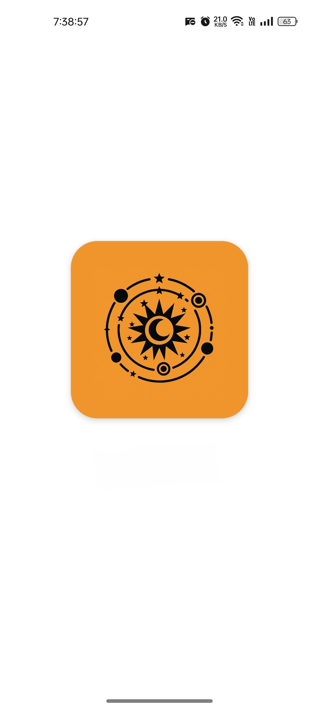
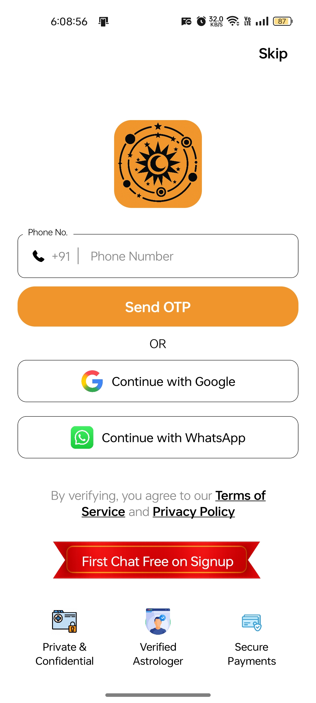
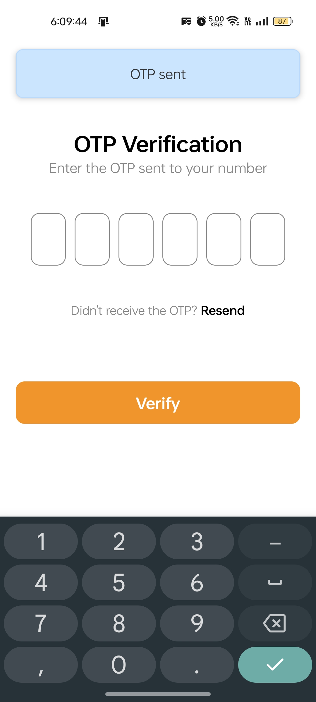
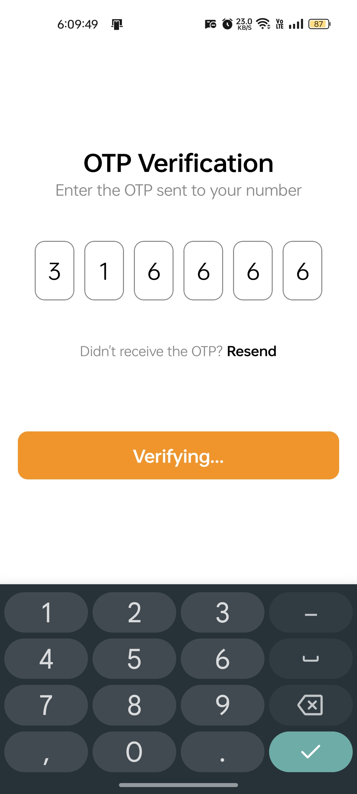
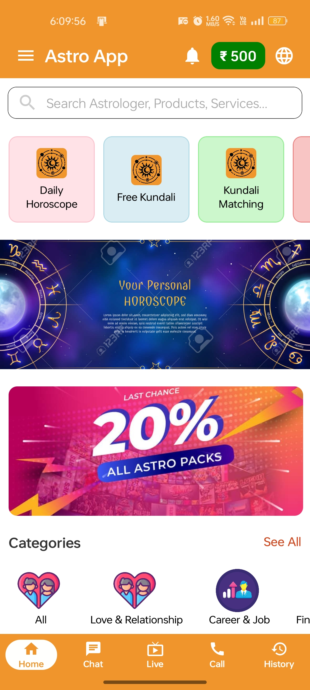
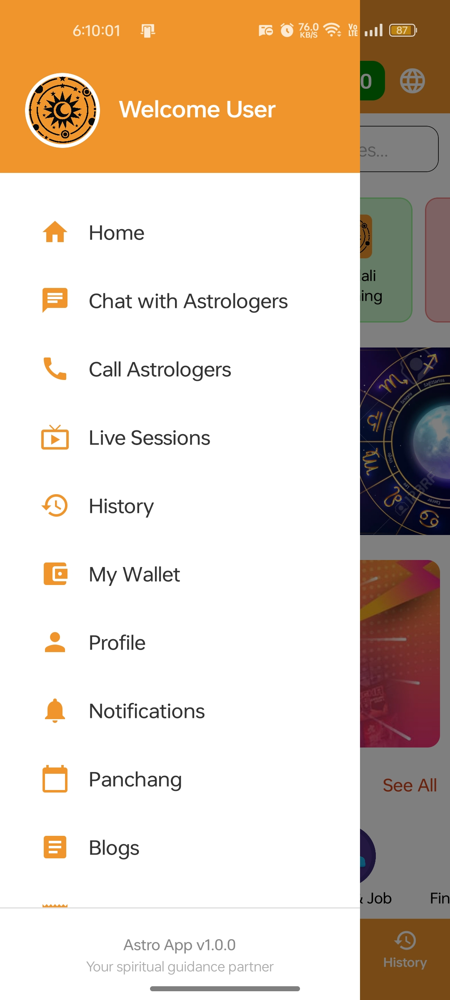
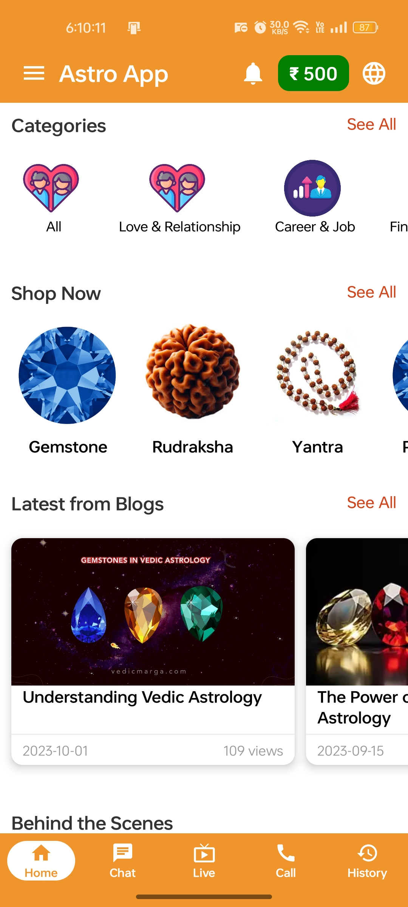
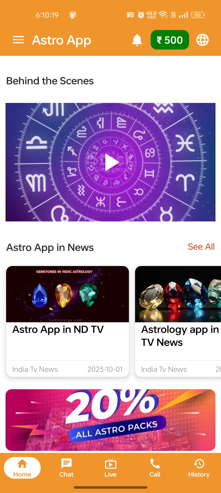

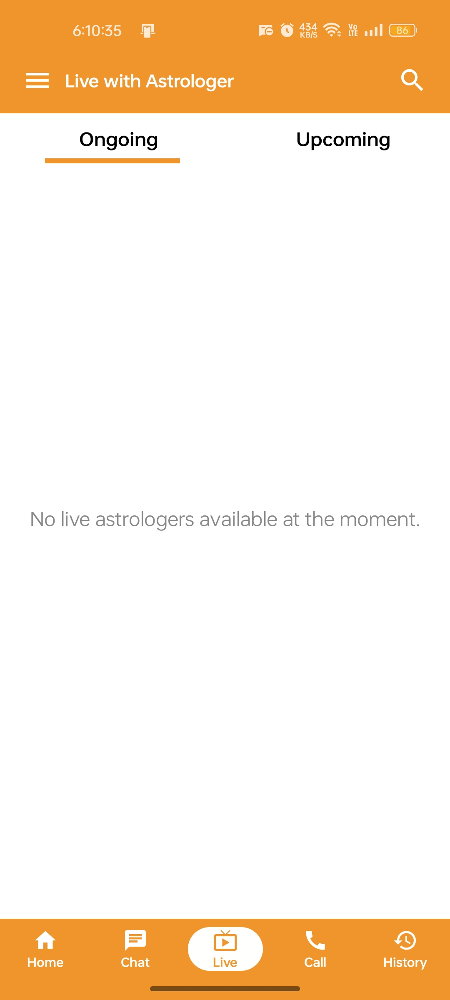
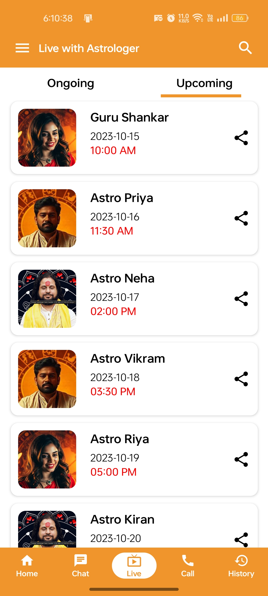

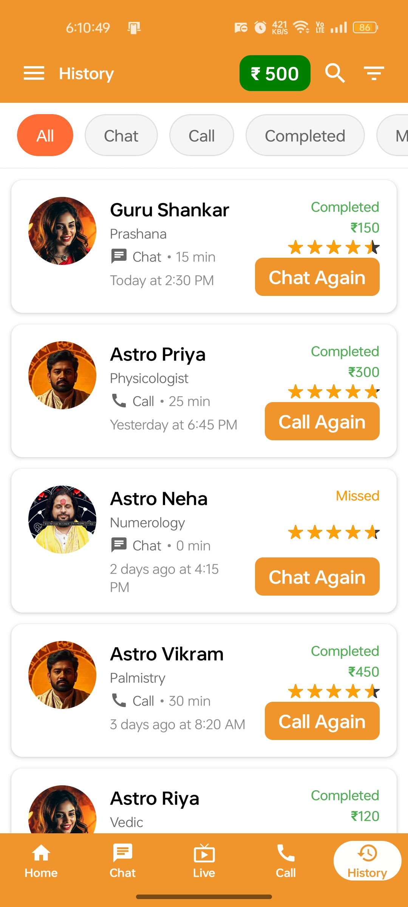
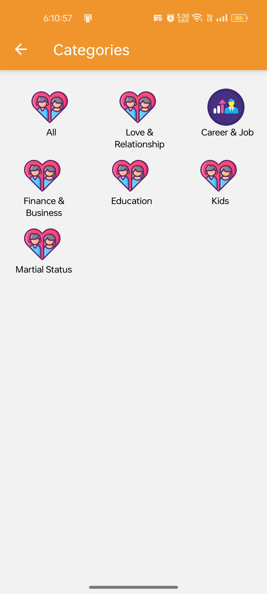
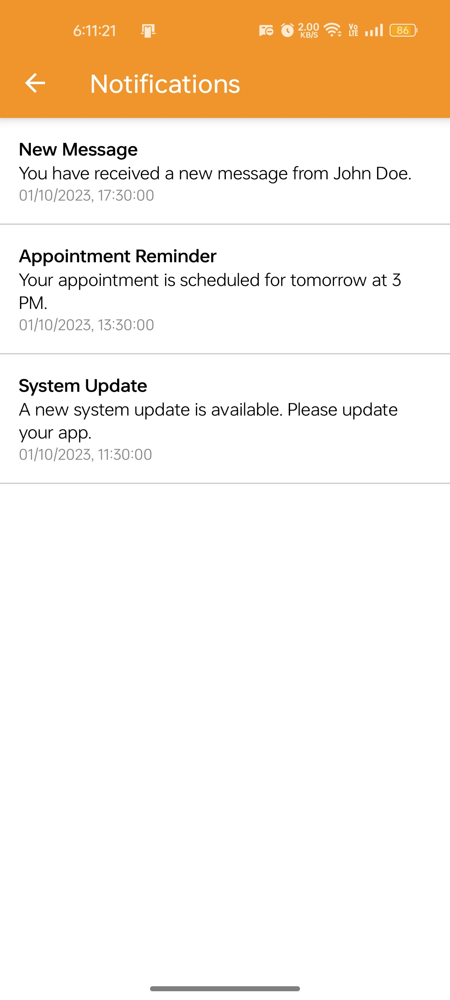
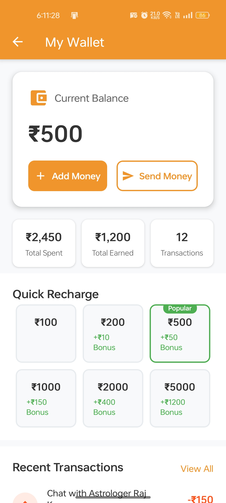
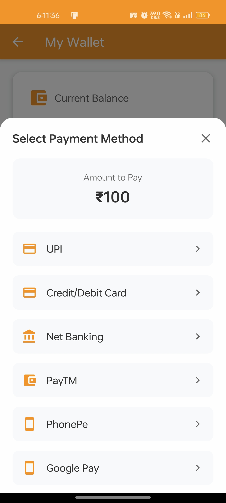

</div>

## 🚀 Getting Started

### Prerequisites

- Node.js (16 or higher)
- npm or yarn
- Expo CLI
- Android Studio (for Android development)
- Xcode (for iOS development - macOS only)

### Installation

1. **Clone the repository**

   ```bash
   git clone https://github.com/Satyndr/Astro-App.git
   cd astro_app
   ```

2. **Install dependencies**

   ```bash
   npm install
   ```

3. **Start the development server**

   ```bash
   npm start
   ```

4. **Run on specific platform**

   ```bash
   # Android
   npm run android

   # iOS
   npm run ios

   # Web
   npm run web
   ```

### Development Scripts

```bash
# Start Expo development server
npm start

# Build for Android (development)
npm run build

# Create Android APK
npm run eas-apk

# Generate release APK
npm run apk

# Update app over-the-air
npm run update-build

# Lint code
npm run lint

# Reset project (clean start)
npm run reset-project
```

## 🌟 Key Features in Detail

### Astrologer Matching System

- Category-based filtering (Love, Career, Health, etc.)
- Rating and experience-based sorting
- Language preference matching
- Availability status tracking

### Content Management

- Dynamic blog content loading
- Daily panchang updates
- News feed with categories
- Video streaming capabilities

### E-commerce Integration

- Product catalog management
- Shopping cart functionality
- Order management system
- Payment processing with Stripe

## 🔐 Security & Privacy

- Secure authentication with OTP
- Encrypted payment processing
- Personal data protection
- Secure API communication
- Local data encryption

## 📈 Performance Optimization

- Lazy loading for better startup time
- Image optimization with Expo Image
- Efficient list rendering
- Memory management for video content
- Background task handling

## 🛠️ Building for Production

### Android APK

```bash
# Development build
npm run build

# Preview build (APK)
npm run eas-apk

# Local release build
npm run apk
```

### iOS Build

```bash
# iOS development build
eas build --platform ios --profile development

# iOS production build
eas build --platform ios --profile production
```

\*_Made with ❤️_
